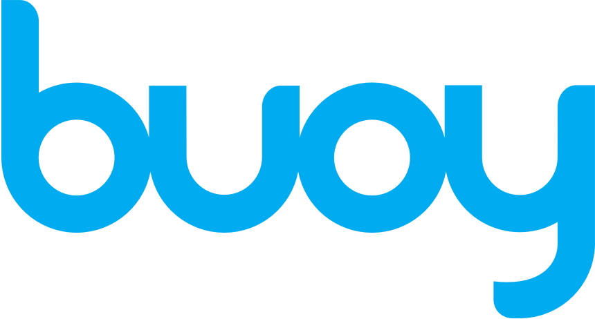

# AI Case Study:

## Overview and Origin

* **Name of company**
  - [Buoy Health](www.buoyhealth.com)

* **When was the company incorporated?**
  - Jan 1st, 2014

* **Who are the founders of the company?**
  - Co-Founders | [Andrew Le](https://www.linkedin.com/in/andrewle21/), [Adam Lathram](https://www.linkedin.com/in/adam-lathram-buoy-health/), [Eddie Reyes](https://www.linkedin.com/in/rwxszxkh/) , and [Nathanael Ren](https://www.linkedin.com/in/nathanaelren/)

* **How did the idea for the company (or project) come about?**
  - Andrew Le, founded the company while studying to become a doctor at Harvard.  During his last rotation in the emergency room, he observed that many patients had incorrectly self diagnosed their symptoms before coming into the ER for help. In many of his interactions, patients were pulling up print-outs from WebMD to tell him what needed to be done, reasons why they believed their condition was an emergency *(when it wasn’t)* or they believed it wasn’t *(when it most certainly was)*. The tipping point came when his father suffered a mini-stroke, wasn’t aware that it was an emergency and didn’t inform Andrew till  months later. When questioned why his father hadn’t reached out or researched it on the internet to, Andrew’s father said that he didn’t trust the internet and also that he didn’t want to trouble his son while he was in his last rotation. Andrew came to the understanding that for consumers, shopping for healthcare is almost impossible as they needed to a doctor and insurance expert rolled into, and that this knowledge gap was leading to more issues, delayed treatment, that could soon turn prohibitively expensive if a condition was threatening and not treated in time given our cost of healthcare in the US. 

* **How is the company funded? How much funding have they received?**
  - Buoy Health has raised a total of $87.7 Million in funds from private investors that included investors from the Insurance industry *(Humana, Cigna)* in addition to some premier investment firms. Their most recent funding was raised on Nov 10, 2020 from a Series C round. 
  - In Jan 2023, the Buoy was not able to raise a Series D round and had to lay off 96% of their staff.  Currently, a small crew of 8 employees are diligently engaged on the site  in their mission to continue to educate, inform, and connect visitors to making right healthcare decisions.

## Business Activities

* **What specific problem is the company or project trying to solve?**
  - Buoy Health’s mission is to empower and educate people make the best decisions about their health. 

* **Who is the company's intended customer? Is there any information about the market size of this set of customers?**
  - Any consumer inflicted with a potential health concern or issue, and has turned to the internet as a resource to educate themselves or find care is a customer. According to data from the Pew Research, about 80% of adult internet users in the US search for health information online, which translates to approximately 6% of internet users on a typical day. BuoyHealth in its prime reported receiving traffic of ~ 4 Million users / day that visited the site.

* **What solution does this company offer that their competitors do not or cannot offer? (What is the unfair advantage they utilize?)**
  - The AI Symptom Checker was something that truly set the company apart from the competitors in the space. This product was responsible for recruiting 60% of traffic to the site. Additionally, the educational content/ articles, that users were funneled into post Symptom Checker diagnosis, also independently recruited 30% of the traffic. These products together created an informed and higher intent consumer for the health care and services that were available on Buoy’s healthcare marketplace.
   

* **Which technologies are they currently using, and how are they implementing them?**
  - The Symptom Checker employed a variety of AI components. Rules based AI, NLP, Machine Learning trained agents, knowledge graphs, and Bayesian models. 
  - The Symptom Search at the beginning of the AI Symptom Checker involves:
    1. **Predictive Text:** User gets type ahead search suggestions based on machine learning models trained on search data.
    2. **Natural Language Processing (NLP):** Based on the users inputs or selections, converted it to structured data. *Eg. “I have a headache and fever”,* which the system identifies keywords of interest from *(eg. ‘Headache’, ‘fever’)*
    3. **Alarm Agents:** Rules based on triage protocols. Incase the user provided inputs indicated that a health emergency was at play and the user should immediately call 911.
    4. **Diagnosis Agents:** The agent uses knowledge graphs to match clinical information (symptoms, risk factors, etc) to potential diagnoses, drawing on thousands of data points from medical literature and case studies, to generate a differential diagnosis and feed into the Bayesian model.
    5. **Bayesian Statistical Model:** The model was employed for its ability to probabilistically diagnose the symptoms. A nice short video explaination of Bayesian Statistics for Dummies can be found on [YouTube](https://www.youtube.com/watch?v=Oo-OrePF2dc&ab_channel=QuantPsych).

## Landscape

* **What field is the company in?**
  - The company is in the Healthcare field, and serves as a 2 sided marketplace for care seekers and providers to connect with each other to secure services and/or treatments to alleviate their medical concerns.

* **What have been the major trends and innovations of this field over the last 5 - 10 years?**
  - The Affordable Care Act *(ACA)* significantly pushed the digitization of healthcare by incentivizing the adoption of electronic health records (EHRs). This allowed for better data accessibility, improved care coordination, and increased patient engagement in their health information; this facilitated the development and integration of digital health tools like Telehealth and patient portals, ultimately enabling a more data-driven and patient-centered approach to healthcare delivery. While digital medicine was slowly making in-roads, it was embraced and garnered adoption during the Covid epidemic in 2020. Healthcare rules and regulations were slightly relaxed and TeleHealth dominated as the form of delivery for health services. This really gave birth to a number of companies *(psychological, prescription, therapeutics, Fertility, PT, primary care, etc)* in the space that previously were primarily delivering care in-person to now employ the internet.  

* **What are the other major companies in this field?**
	- Calm 
	- Cedar
	- Memora  
	- Lyra Health
	- Akili Interactive
  - Carrot Fertility, Inc

## Results

* **What has been the business impact of this company so far?**
  - Unfortunately, while the company had close to +4 Million daily visitors to the site, to self-diagnose or educate themselves on a health condition, conversion was woefully short. Buoy is short staffed post failure to raise a Series D round and has recently announced strategic partnerships with several digital and brick-and-mortar companies to provide access to GLP-1 medications and in-depth weight reduction coaching. It aims to transform type 2 diabetes care and weight control for people across the country by offering customized support and reasonably priced solutions.

* **What are some of the core metrics that companies in this field use to measure success? How is your company performing based on these metrics?**
    - Core Metrics that the company uses to measure success:
		  - Revenue 
		  - Traffic 
		  - CVR (conversion rate, ie click through from information presented to purchase or appointment scheduled)

	  -	In the 3Q of 2022, before the company was unsuccessful in their Series D, the following information was made available for 3Q results:
		  - Revenue (+21% | $36K > $43K ), Traffic (+15% | 4.4M > 5M), CVR (+77% | 0.12% > 0.21%)

* **How is your company performing relative to competitors in the same field?**
  - While traffic growth and trajectory of new products enhancements were slowly starting to bear fruit, the company was not profitable as Covid related product revenues and state funding, that served as the cash cow product to the business has dried up by 2022. The company’s high burn rate was eating up into its cash runway. High marketing costs *(High CAC, Low LTV)* and G&A expenses were eating into the projected cash runway faster than expected. 
  - A number of HealthTech companies with similar goals and aspirations also faced the same issues and had if not were close to obscurity. Health IG, Pear Therapeutics, Akili Interactive, Babylon Health, some of the foremost leaders in the space did their being to perform hard pivots in their respective product and service offerings, but eventually were acquired, or eventually declared bankruptcy. 

## Recommendations

* **If you were to advise the company, what products or services would you suggest they offer? (This could be something that a competitor offers, or use your imagination!)**
  - The Digital Healthcare Industry has been hit hard during this recent financial crisis. While many have gone belly up, I strongly believe that Buoy should seek out partnerships with the Major Insurance Service Providers to offer their AI Symptom Checker as a way to help their subscribers with preventative and at-home services to address minor / medium health care concerns and reduce the cost of care. In the same vein, it should target Employers to offer Buoy as a corporate wellness benefit, helping employees access timely and accurate health information. Currently the application doesn’t require a profile to be created prior or post use of the product. Buoy should encourage users to register prior to using the application to create a profile that can then be used to track medical history and the users behavior. Lastly, given the level of traffic that visits the site, the platform could serve as a way to recruit users for complex pharmaceutical trials.  

* **Why do you think that offering this product or service would benefit the company?**
  - Recruiting for Pharmaceutical Trials is a tremendously hard endeavor for the industry. Buoy has access to 80% of adult US internet users health inquiries and could quite easily narrow down and match user profile to the specific diseases of interest to the pharmaceutical industry. This service could be quite profitable given the reach that Buoy currently has. 

* **What technologies would this additional product or service utilize?**
  - Technology needs would map to having a registration portal and workflow, and a secure data store that is HIPPA compliant as it would contain PII and possibly sensitive health care information. Beyond that we could get fancy and create an internal portal with the appropriate filters that Buoy’s internal team could use to search for and filter the specific demographic, psychographic, medical history that is of interest to the pharmaceutical organization. 

* **Why are these technologies appropriate for your solution?**
  - This is the simplest minimum viable product needs to create this solution and if vetted and proven to be financially profitable, could then be further expanded in its feature set. I believe with this minimal investment, the idea could be thoroughly vetted to gauge its viability without major risks to the already hamstrung budget that Buoy is currently operating on. 

## Resources:
  - Pew Research: <https://www.pewresearch.org/internet/2003/07/16/internet-health-resources/#:~:text=Half%20of%20American%20adults%20have,16%20major%20health%20topics%20online>
  - Funding: <https://www.crunchbase.com/organization/buoy-health/company_financials>
  - Bankruptcy: <https://www.healthcare-brew.com/stories/2023/10/02/digital-health-startups-declare-bankruptcy-following-rough-funding-year>
  - BuoyHealth Harvard Innovation Lab: <https://d3.harvard.edu/platform-rctom/submission/buoy-healths-mission-to-debunk-dr-internet/>
  - Bayesian Statistical Review: <https://www.youtube.com/watch?v=Oo-OrePF2dc&ab_channel=QuantPsych>
